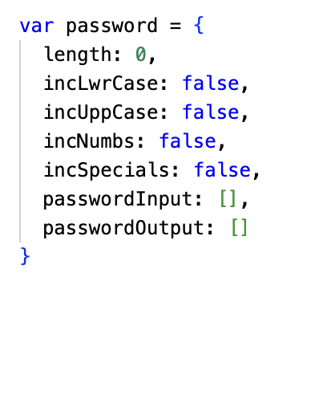
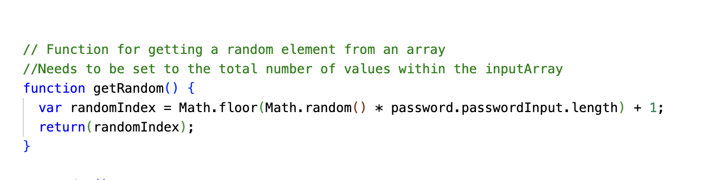
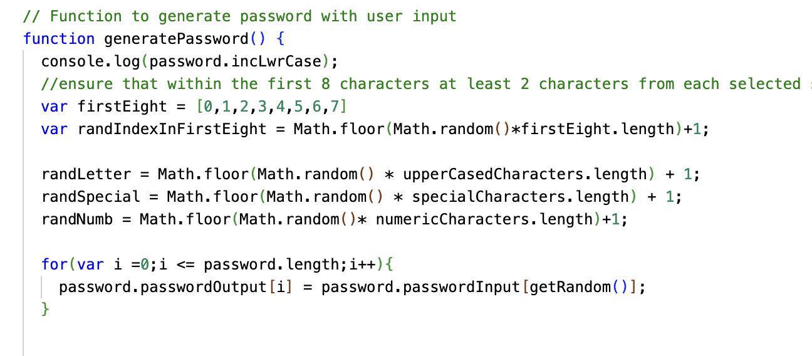
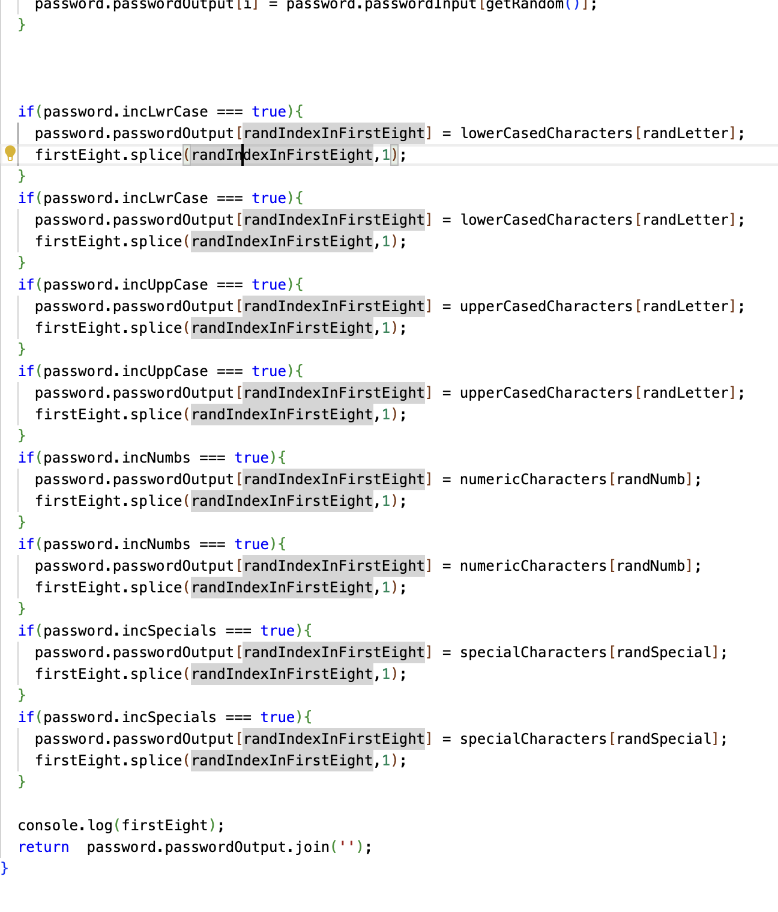
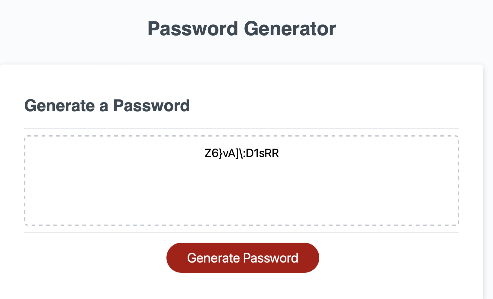

# Random-Password-Generator
Description :JS web application which generates random passwords based on user criteria

This web application generates a password based on user specifications. The password selected by the user must be greater than 8 characters and no more than 128 characters. 

The user can select from one or more of the following sets of characters to generate their password:

1. Lower case characters
2. Upper case characters
3. Numeric characters
4. Special characters.

There are three central functions which underpin the logic of this password generator and an object Password which undergirds the password generation process from user definition to system output. This readme will discuss the final application in terms of the functions and objects which underpin its functionality.

## Password object.

The following object is initialised following the declarations of the arrays which constitute the various sets of characters from which a user password can be created.

The length attribute is initialised to 0. This will be set in accordance with the user specifications for the eventual password length. 

The incLwrCase, incUppCase, incNumbs and incSpecials are booleans initialised to false. Based on user input these values will be updated to true iff the user requests when asked for the inclusion of the respective character types.

Finally, passwordInput and passwordOutput are empty arrays at initialisation. 

passwordInput will be the set of all characters which the eventual password will be contituted from. Put another way, it will be comprised of the subsets of all different character types selected by the user for inclusion. If for example the user approves the inclusion of numeric characters and upper cased characters only- then password input will be constituted of all of the elements of the set numeric characters and all of the elements of the set upper cased characters. 

passwordOutput on the otherhand will be the array which will contain the characters which following modification will form the password generated by the app. PasswordOutput will be subjected to modification to ensure that the final password at least contains one of each character sets desired by the end user.

## 1. GetOptions

The purpose of the get options function is twofold. It should (1) capture user specifications for their password to be generated and (2) subject the specifications made to validation in terms of minimum and maximum length of the final password.

The following code initiates a "do... while" loop. The user is first prompted to enter the length of their desired password.

If the desired password is less than 8 characters then the user is alerted to this fact and it is relayed that the password is too smalle. The user is then prompted again to chose a number between 8 and 128.

Conversley, if the desired password is in excess of 128 characters- then the password is rejected for being too long, an alert is triggered which explains this and the user is reverted back to the initial prompt requesting a password in length of between 8 and 128 characters.

Once the validation of the users password is complete, the code progresses to the stage where user choice is entered regarding the character sets to be included in the final password.

A character set is selected for inclusion in the final password when a user selects "Ok" to the relevant prompts. By selecting "Ok" the relevant character set is appended to the password object attribute "passwordInput". This storage enables later manipulation.

As a fail safe for an instance where an end-user does not select any character sets an alert will display to the user and advise them that at least one character set must be included for the final password. Using the location.refresh function, the screen browser will then reload and reset the code requesting a password length and once again the character sets to be included.

The GetOptions function finishes by returning the passwordObject modified to store the users choice in response to prompts regarding length and the character sets scheduled for inclusion.

## 2. GetRandom

The get random section is simply a random number generating function. GetRandom returns a random numbers within the logical space of the passwordInput arrays length.

The functions aim is to provide a means of adding elements from the inputPassword into the outputPassword array in the final function. The random nature of the function ensures that a random index can be selected from the array of all possible values (input) into the final resultant password (output).

## 3. GeneratePassword.

The generate password starts with a further random number generator. The purpose of this random number generator is to ensure that there are no instances in the final password production process where one of the selected character sets is not included.

The random number array ensures that for all of the included character sets, at least two randomly determined positions in the outputed password are of this password type. This supplements the choice in the getOptions function to append the numeric character set twice over in the instance that numeric characters are included. The reason for this is to compensate for the smaller probability of a numeric character being selected in virtue of their being only 10 numeric characters in distinction to approx. 20 special characters and 26 alphabetic characters.

Following this step, the code then incorporates in the passwordOutput array a character from the array of all selected character sets until the length of the passwordOutput is equal to the user defined length.

It is only after the passwordOutput is made that its first eight elements are subjected to modification based on the random number generator in the generatePassword function defined above. Note that for each of the character sets elected for inclusion (of which there are 4) two random positions in the array will be converted to the respective character type to ensure inclusion in small arrays where it is more probable that a final array could be produced where the array lacked a character from the elected character sets.

## Outputs

The final result is illustrated below. The example of an instance when a user has selected to include characters of all types.

